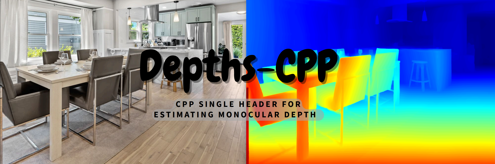
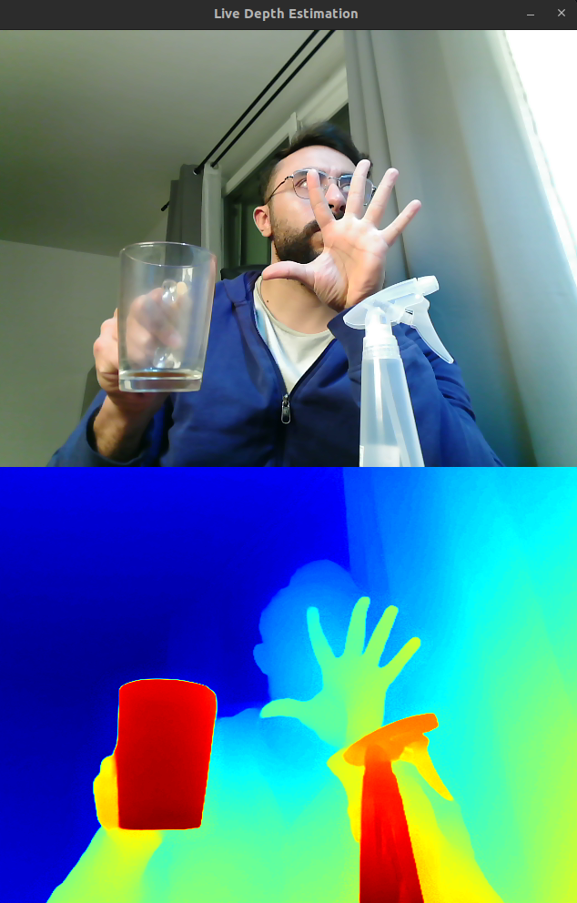

# Depths-CPP




 


---

## Overview

**Depths-CPP** provides single c++ header with high-performance application designed for real-time depth  estimation using  models from [Depth-Anything-V2](https://github.com/DepthAnything/Depth-Anything-V2). Leveraging the power of [ONNX Runtime](https://github.com/microsoft/onnxruntime) and [OpenCV](https://opencv.org/), this project provides seamless integration for image, video, and live camera inference. Whether you're developing for research, production, or hobbyist projects, this application offers flexibility and efficiency.

It features:
- Multi-threaded architecture
- Adaptive batch size
- Real-time display options
- ONNX GPU acceleration
- Cross-platform compatibility

Supports flexible execution providers: **TensorRT**, **CUDA**, or **CPU**.


---

## 📦 Integration in your C++ project

```cpp
#include <opencv2/opencv.hpp>
#include <iostream>
#include <string>
#include "depth_anything.hpp" // Ensure this is in your include path

int main() {
    std::string modelPath = "models/vits_metric_indoor.onnx";
    std::string imagePath = "data/indoor.jpg";
    bool useCuda = false; // Change to true if using a CUDA-enabled GPU
    DepthAnything depthEstimator(modelPath, useCuda);

    cv::Mat inputImage = cv::imread(imagePath, cv::IMREAD_COLOR);
    cv::Mat depthMap = depthEstimator.predict(inputImage);

    cv::Mat depthVis;
    cv::normalize(depthMap, depthVis, 0, 255, cv::NORM_MINMAX, CV_8U);
    cv::Mat depthColor;
    cv::applyColorMap(depthVis, depthColor, cv::COLORMAP_JET);

    cv::imshow("Original", inputImage);
    cv::imshow("Depth", depthColor);
    cv::waitKey(0);
    return 0;
}
```
> **Note:** For more usage, check the source files: [image_depth_estimation.cpp](src/image_depth_estimation.cpp), [video_depth_estimation.cpp](src/video_depth_estimation.cpp), [camera_depth_estimation.cpp](src/camera_depth_estimation.cpp).


---

## 🧠 Features


- **Multiple Depth Anything V2 Models**: Supports Depth Anything V2 with standard and quantized ONNX models for flexibility in use cases.
  
- **ONNX Runtime Integration**: Leverages ONNX Runtime for optimized inference on both CPU and GPU, ensuring high performance.
  - **Dynamic Shapes Handling**: Adapts automatically to varying input sizes for improved versatility.
  - **Execution Providers**: Configures sessions for CPU or GPU (e.g., `CUDAExecutionProvider` for GPU support).
  - **Input/Output Shape Management**: Manages dynamic input tensor shapes per model specifications.
  - **Batch Processing**: Supports processing multiple images, currently focused on single-image input.
- **Real-Time Inference**: Capable of processing images, videos, and live camera feeds instantly.
- **Cross-Platform Support**: Fully compatible with Linux, macOS, and Windows environments.
- **Easy-to-Use Scripts**: Includes shell scripts for straightforward building and running of different inference modes.


---

## ⚙️ Requirements

- **C++17 or later**
- **OpenCV ≥ 4.5.5**
- **CMake ≥ 3.14**
- **ONNX Runtime**: Tested with version 1.16.3 and 1.19.2, backward compatibility [Installed and linked automatically during the build].
- **CUDA Toolkit ≥ 11.0** (if using GPU)

---

## 🔧 Installation

```bash
git clone https://github.com/Geekgineer/Depths-CPP
cd Depths-CPP
```

### Configure and Build

Ensure OpenCV is installed, and configure ONNX Runtime version inside `build.sh`. Then:

```bash
./build.sh
```

>Note: This script will download onnxruntime headers, create a build directory, configure the project, and compile the source code. Upon successful completion, the executable files (camera_inference, image_inference, video_inference) will be available in the build directory.

---

## 🚀 Usage

Run inference from camera, image, or video:

### Image Inference
```bash
./run_image.sh
```

### Video Inference
```bash
./run_video.sh
```

### Camera Inference
```bash
./run_camera.sh
```



---

## 🧪 Model Zoo

While ONNX provides a cross-platform format for model compatibility, exporting the model directly for the target device or optimizing it for specific hardware can significantly improve performance. To achieve the best inference speed and resource efficiency, it's generally recommended to tailor the export process to the hardware on which the model will run.

The project includes several pre-trained and pre-exported standard DepthAnything2 models, located in models. However, it’s not recommended to use these directly. Instead, you should always export your PyTorch models using the [`export_depthanything_onnx.ipynb`](notebook/export_depthanything_onnx.ipynb)script.

| Model Name                    | Resolution | Type      | Notes                         |
|------------------------------|------------|-----------|-------------------------------|
| `vits.onnx`                  | 384x384    | FP32 Normilized Depth      | ViT-Small base model          |
| `vits_quint8.onnx`           | 384x384    | UNINT8 Normilized Depth Quantized | Compact, edge-optimized       |
| `vits_metric_indoor.onnx`    | 384x384    | FP32 Metric Depth    | Indoor scenes                 |
| `vits_metric_outdoor.onnx`   | 384x384    | FP32 Metric Depth   | Outdoor scenes                |


---

## ⌨️ Runtime Controls

| Key        | Action                                  |
|------------|-----------------------------------------|
| `q` / `ESC`| Quit                                    |
| `m`        | Toggle display mode                     |
| `+` / `-`  | Adjust frame skipping                   |

---

## 👥 Contributing

Fork → Edit → PR!  

<details>
<summary>Contributions are welcome! Please follow these steps to contribute:</summary>
<br>

1. **Fork the Repository**: Click the "Fork" button at the top-right corner of this repository to create a personal copy.

2. **Clone Your Fork**:
    ```bash
    git clone https://github.com/Geekgineer/Depth-Anything-V2-CPP
    cd Depth-Anything-V2-CPP
    ```

3. **Create a New Branch**:
    ```bash
    git checkout -b feature/YourFeatureName
    ```

4. **Make Your Changes**: Implement your feature or bug fix.

5. **Commit Your Changes**:
    ```bash
    git commit -m "Add feature: YourFeatureName"
    ```

6. **Push to Your Fork**:
    ```bash
    git push origin feature/YourFeatureName
    ```

7. **Create a Pull Request**: Navigate to the original repository and click "New Pull Request" to submit your changes for review.


</details>

---

## 📜 License

Licensed under **MIT License**.  

---

## 🙏 Acknowledgments

- https://github.com/DepthAnything/Depth-Anything-V2
- https://github.com/spacewalk01/depth-anything-tensorrt
- https://github.com/zhujiajian98/Depth-Anythingv2-TensorRT-python
- https://github.com/fabio-sim/Depth-Anything-ONNX
- https://huggingface.co/spaces/Xenova/webgpu-realtime-depth-estimation
- https://huggingface.co/onnx-community

---
