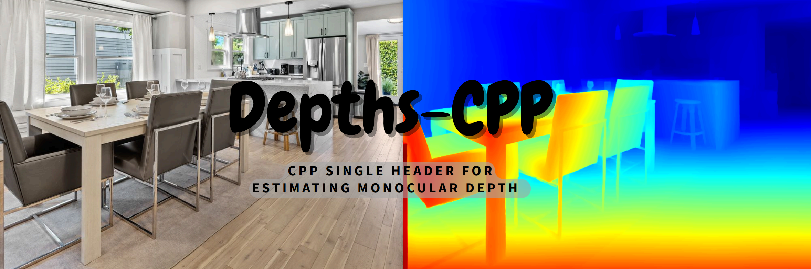

<div align="center">

# Depths-CPP

### ⚡ Real-time monocular depth estimation in C++ — Depth Anything **V2 & V3** in a single header



[](LICENSE)


**One class. Any model. Image · Video · Live camera.**
Drop-in `#include`, automatic model detection, GPU acceleration via TensorRT/CUDA, graceful CPU fallback.

<br>


</div>

---

## Why Depths-CPP?

Most depth-estimation code lives in Python notebooks. **Depths-CPP** gives you a production-ready, dependency-light C++ engine you can embed anywhere — robotics, AR, video pipelines, edge devices — with the same header driving **both Depth Anything V2 and the new [Depth Anything 3](https://github.com/ByteDance-Seed/Depth-Anything-3)**.

- 🧩 **Single header** — `#include "depth_anything.hpp"`, construct one object, call `predict()`. That's it.
- 🤖 **V2 **and** V3, auto-detected** — relative, monocular, and metric models work through the *same* API. The engine inspects the ONNX graph (output rank, patch size, extra `sky` output) and configures itself.
- 🚀 **GPU-accelerated** — TensorRT (FP16 + on-disk engine cache) → CUDA → CPU, selected automatically at runtime.
- 🎥 **Batteries included** — ready-to-run **image**, **video**, and **multi-threaded live camera** apps with adaptive batching and back-pressure.
- 🎯 **Correct by construction** — preprocessing mirrors the official DA3 `InputProcessor` exactly (RGB, ImageNet normalization, ÷14 patch alignment).
- 🪶 **Fast & lean** — reused I/O buffers (no per-frame allocations), vectorized normalization, zero-copy frame paths.
- 🌍 **Cross-platform** — Linux, macOS, Windows; x86-64 and ARM64 (Jetson).

---

## Table of Contents

- [Quick Start](#-quick-start)
- [Get a Model](#-get-a-model)
- [Usage](#-usage)
- [Integrate in Your Project](#-integrate-in-your-project)
- [Performance](#-performance)
- [How It Works](#-how-it-works)
- [FAQ & Troubleshooting](#-faq--troubleshooting)
- [Roadmap](#-roadmap)
- [Contributing](#-contributing)
- [Acknowledgments](#-acknowledgments)

---

## 🚀 Quick Start

```bash
# 1. Clone
git clone https://github.com/Geekgineer/Depths-CPP
cd Depths-CPP

# 2. Build (downloads ONNX Runtime, configures CMake, compiles)
./build.sh

# 3. Run on the sample image (a V2 model ships with the repo)
./run_image.sh
```

> `build.sh` fetches the ONNX Runtime release for your platform (GPU build on Linux/Windows), then builds three executables into `build/`: `image_depth_estimation`, `video_depth_estimation`, `camera_depth_estimation`.

**Requirements:** C++17 · OpenCV ≥ 4.5 · CMake ≥ 3.14 · (optional) CUDA ≥ 11 and TensorRT for GPU.

---

## 📦 Get a Model

### Depth Anything 3 (recommended)

Export any DA3 checkpoint to an ONNX graph the engine consumes directly:

```bash
pip install depth-anything-3 onnx onnxsim   # plus torch/torchvision for your CUDA

# Relative monocular depth — fast, ideal for camera/video:
python scripts/export_da3_onnx.py --model da3mono-large \
    --process-res 504 --fp16 --output models/da3mono_large.onnx

# Metric depth in meters (auto-adds & handles the "sky" output):
python scripts/export_da3_onnx.py --model da3metric-large --metric \
    --process-res 504 --output models/da3metric_large.onnx
```

The graph exposes input `image` `(N,3,H,W)` and output `depth` `(N,1,H,W)` (plus `sky` for metric), with dynamic batch/height/width. See [`scripts/export_da3_onnx.py`](scripts/export_da3_onnx.py) for the full contract and exporter options.

> **Exporter tip:** PyTorch's two ONNX exporters support different ops, and DA3 variants differ in which they use. If the default export hits `aten::cartesian_prod`, retry with `--dynamo`; for a RoPE backbone that trips `torch.export`, add `--static`. If both fail on a variant, pin the torch version used by the community exporters ([MoonCodeMaster](https://github.com/MoonCodeMaster/Depth-Anything-3-Onnx) / [devin-lai](https://github.com/devin-lai/Depth-Anything-3-Onnx)). The C++ engine consumes any valid DA3 depth ONNX regardless of how it was produced.

### Depth Anything 2

Pre-exported ViT-Small models ship in [`models/`](models/) so you can run immediately:

| Model | Type | Notes |
|---|---|---|
| `vits.onnx` | Relative depth (FP32) | ViT-Small base model |
| `vits_quint8.onnx` | Relative depth (UINT8) | Quantized, edge-optimized |
| `vits_metric_indoor.onnx` | Metric depth (FP32) | Indoor scenes |
| `vits_metric_outdoor.onnx` | Metric depth (FP32) | Outdoor scenes |

Export your own with [`notebook/export_depthanything_onnx.ipynb`](notebook/export_depthanything_onnx.ipynb).

---

## 🎮 Usage

### Image

```bash
./build/image_depth_estimation <model.onnx> <image_or_folder> [output_dir]
# e.g.
./build/image_depth_estimation models/vits.onnx data/indoor.jpg ./depth_maps
```
Saves a color-mapped depth PNG and a 16-bit raw depth PNG. A single image also opens a preview window.

### Video

```bash
./build/video_depth_estimation <model.onnx> <input_video> <output_video.mp4>
# e.g.
./run_video.sh
```
Writes a side-by-side `original | depth` video. Set `DEPTH_FOURCC=H264` to override the codec if your OpenCV build supports it.

### Live Camera (multi-threaded)

```bash
./build/camera_depth_estimation <model.onnx> <camera_id> [display_mode] [skip_frames] [resolution]
# e.g.
./build/camera_depth_estimation models/vits.onnx 0 both 2 266
```

| Display mode | Result |
|---|---|
| `original` | Camera stream only |
| `depth` | Depth map only |
| `both` | Split original/depth view (default) |

**Runtime controls:** `q`/`Esc` quit · `m` cycle display mode · `+`/`-` adjust frame skipping.

`resolution` is the engine's input long-side (rounded to a multiple of 14) — smaller is faster, larger is sharper.

---

## 🔌 Integrate in Your Project

**Simple API** (backward-compatible, works for any V2/V3 model — the family is auto-detected):

```cpp
#include <opencv2/opencv.hpp>
#include "depth_anything.hpp"

int main() {
    DepthAnything estimator("models/da3mono_large.onnx", /*useCuda=*/true);

    cv::Mat image = cv::imread("data/indoor.jpg", cv::IMREAD_COLOR);
    cv::Mat depth = estimator.predict(image);          // CV_32FC1, input resolution

    cv::Mat vis, color;
    cv::normalize(depth, vis, 0, 255, cv::NORM_MINMAX, CV_8U);
    cv::applyColorMap(vis, color, cv::COLORMAP_TURBO);
    cv::imshow("Depth", color);
    cv::waitKey(0);
}
```

**Full control** via `depth::Config`:

```cpp
depth::Config cfg;
cfg.modelPath    = "models/da3mono_large.onnx";
cfg.provider     = depth::Provider::Auto;            // TensorRT → CUDA → CPU
cfg.precision    = depth::Precision::FP16;           // for GPU providers
cfg.resizeMode   = depth::ResizeMode::AspectLongest; // matches DA3 upper_bound_resize
cfg.process_res  = 518;                              // long side, rounded to ×14
cfg.maxBatchSize = 8;

DepthAnything estimator(cfg);
std::vector<cv::Mat> depths = estimator.predictBatch(frames);
bool metric = estimator.isMetric();  // true → depth is in meters
```

---

## 📊 Performance

The engine minimizes overhead around inference: reused input/output buffers (no per-frame heap allocation), vectorized normalization, single aspect-correct resize, and provider offload to the GPU.

Measured reference point (ViT-Small, batch 16, **CPU-only** ONNX Runtime on an 8-core Intel i7-1185G7):

| Provider | Model | Per-frame | Notes |
|---|---|---|---|
| CPU | ViT-S (`vits.onnx`) | ~310 ms | Saturates ~7/8 cores; ~3 FPS |
| CUDA / TensorRT FP16 | — | **provider-dependent** | Offloads compute to GPU; CPU load drops sharply and throughput scales with the device |

> GPU numbers vary widely by hardware; measure on your target with the built-in per-batch timing (video app prints `Batch of N processed in … ms`). TensorRT builds a shape-specialized engine on first run and caches it in `trt_engine_cache/`, so the first inference is slow and subsequent runs are fast.

**Tuning tips:** lower `process_res` for real-time camera use, raise `maxBatchSize` for video throughput, use quantized/FP16 models on constrained devices, and keep the TensorRT engine cache between runs.

---

## 🧠 How It Works

```
             ┌──────────────┐   RGB /255   ┌──────────────┐   ONNX Runtime    ┌──────────────┐
 cv::Mat ───▶│ preprocess   │─ ImageNet ──▶│  input blob  │─ TensorRT/CUDA/──▶│  depth (N,·) │──▶ cv::Mat
 (BGR)       │ resize ÷14   │  normalize   │ (reused buf) │      CPU EP       │  auto-decode │   (depth map)
             └──────────────┘              └──────────────┘                   └──────────────┘
```

At construction the engine introspects the ONNX graph and adapts automatically:

- **Family** — 4-D depth output `(N,1,H,W)` ⇒ V3; 3-D `(N,H,W)` ⇒ V2.
- **Patch size** — 14 (DINOv2) vs 32, inferred and enforced when rounding input dimensions.
- **Metric vs relative** — an extra `sky` output marks a metric model; the engine still selects the `depth`-named output correctly, regardless of output order.
- **Static vs dynamic** — fixed-shape models use their baked-in resolution; dynamic models are resized per `resizeMode`/`process_res`.

Preprocessing faithfully reproduces the official DA3 `InputProcessor`: **RGB**, `/255`, ImageNet `mean=[0.485,0.456,0.406]`/`std=[0.229,0.224,0.225]`, aspect-preserving resize to `process_res` rounded to a multiple of 14.

---

## ❓ FAQ & Troubleshooting

<details>
<summary><b>Build error: <code>std::optional</code> / <code>std::filesystem</code> is not available, or <code>undefined reference to pthread_create</code></b></summary>

<br>

Both are fixed in the current `CMakeLists.txt`: the project builds with **C++17** and links **pthread** (`Threads::Threads`) on all targets. If you maintain a custom build, ensure:

```cmake
set(CMAKE_CXX_STANDARD 17)
set(CMAKE_CXX_STANDARD_REQUIRED ON)
find_package(Threads REQUIRED)
target_link_libraries(<target> PRIVATE Threads::Threads)
```
Then reconfigure from a clean build directory (`rm -rf build && ./build.sh`).
</details>

<details>
<summary><b>What CPU usage should I expect?</b></summary>

<br>

With the **CPU** execution provider, ONNX Runtime parallelizes across all cores (intra-op threads = hardware concurrency), so a ViT-S model can use ~7/8 cores during inference (~310 ms/frame on an i7-1185G7). This is expected — depth transformers are compute-heavy.

Use a **GPU provider** (CUDA/TensorRT) to offload the heavy compute to the GPU; CPU usage then drops to mostly I/O and post-processing. You can also cap CPU threads via `depth::Config::intraOpThreads`, lower `process_res`, or use a quantized model.
</details>

<details>
<summary><b>Does it support metric depth?</b></summary>

<br>

Yes. Metric models (DA3 `da3metric-*`, or the bundled `vits_metric_*` V2 models) are detected automatically, and `predict()` returns depth in **meters**. Check `estimator.isMetric()`. The visualization in the sample apps normalizes for display, which discards absolute scale — read the raw `CV_32FC1` map for true metric values.
</details>

<details>
<summary><b>The output video is empty / won't play.</b></summary>

<br>

Some OpenCV/FFMPEG builds report success for the H.264 encoder yet write nothing. The video app defaults to the portable `mp4v` codec and falls back to `MJPG`. To force a codec: `DEPTH_FOURCC=H264 ./build/video_depth_estimation …`.
</details>

<details>
<summary><b>How do I run on NVIDIA Jetson?</b></summary>

<br>

Use the ARM64 GPU build of ONNX Runtime and JetPack's CUDA/TensorRT. The engine auto-selects TensorRT; lower `process_res` (e.g. 266) for real-time camera performance, and keep the `trt_engine_cache/` between runs.
</details>

---

## 🗺️ Roadmap

- [x] Depth Anything V3 support (relative, mono, metric) with graph auto-detection
- [x] TensorRT execution provider (FP16 + engine cache)
- [x] DA3 ONNX export script
- [ ] CUDA I/O binding (zero device↔host copies) for the GPU path
- [ ] Point-cloud / stereo (anaglyph) export
- [ ] Prebuilt binaries & CI matrix (Linux/macOS/Windows)

Have an idea? [Open an issue](https://github.com/Geekgineer/Depths-CPP/issues) or PR.

---

## 👥 Contributing

Contributions are welcome — fork, branch, PR.

```bash
git clone https://github.com/Geekgineer/Depths-CPP
git checkout -b feature/your-feature
# make changes, then:
git commit -m "Add: your feature"
git push origin feature/your-feature
```

Then open a Pull Request. Please keep the single-header style and match the surrounding code.

---

## 📜 License

Released under the **MIT License**. See [LICENSE](LICENSE).

---

## 🙏 Acknowledgments

- [Depth Anything 3](https://github.com/ByteDance-Seed/Depth-Anything-3) · [Depth Anything V2](https://github.com/DepthAnything/Depth-Anything-V2)
- [ONNX Runtime](https://github.com/microsoft/onnxruntime) · [OpenCV](https://opencv.org/)
- ONNX export references: [MoonCodeMaster](https://github.com/MoonCodeMaster/Depth-Anything-3-Onnx) · [devin-lai](https://github.com/devin-lai/Depth-Anything-3-Onnx) · [fabio-sim](https://github.com/fabio-sim/Depth-Anything-ONNX)
- [depth-anything-tensorrt](https://github.com/spacewalk01/depth-anything-tensorrt) · [Depth-Anythingv2-TensorRT-python](https://github.com/zhujiajian98/Depth-Anythingv2-TensorRT-python)

---

<div align="center">

If Depths-CPP helps your project, consider leaving a ⭐ — it helps others find it.

**[⬆ back to top](#depths-cpp)**

</div>
